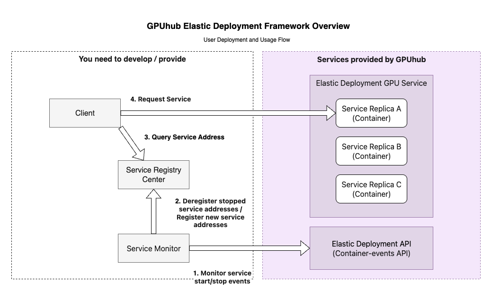

## Creating Deployments

1. If your requirement is to perform a one-time task, it is recommended to use **Container/Job type** deployments. 

2. If it is for service deployment, then **ReplicaSet type** deployment is recommended, as ReplicaSet has the function of managing and maintaining container node replicas.

That is, if a container abnormally exits, the system will automatically pull up a new container to replace it. For service deployment, in addition to using the ReplicaSet feature, it is also necessary to coordinate with service discovery and load balancing to improve reliability and availability (see the subsection below).

## Service Discovery and Load Balancing

When using ReplicaSet type Elastic Deployment GPU deployments, each container provides an independent custom service address (HTTPS protocol) for external services. Due to potential single-point failures causing service stops and ReplicaSet deployments starting new containers to replace stopped ones, dynamic deregistration/registration of each container's service address is needed to achieve high-availability deployment.

Service discovery is generally divided into two types: client-side discovery and server-side discovery. Here, considering simplicity and ease of use, a client-side discovery practice is introduced. This method is more suitable for GPU load scenarios (high computational load, limited GPU VRAM, long single-request response time) and is completed together with load balancing. The architecture is as follows:

From the diagram above, first, a service needs to be developed to poll and minitor for container (temporarily considered equivalent to service) status via GPUHub's "Query Container Events" interface. If there is a stopped container, remove it from the registry; if there is a new running container, register it to the service center.

Finally, before calling the service, the client first obtains the list of service addresses from the service registry, then selects one according to the load balancing strategy for service invocation. This shows that load balancing can be completed together in this step.

**Common Questions:**

**Question**: Why doesn't GPUHub provide load balancing?

**Answer**: If GPUHub provided load balancing, it could simplify user-side usage. However, common Nginx load balancing supports limited strategies and cannot precisely control GPU utilization based on business conditions to reduce costs and increase efficiency.

## Stopping Containers

When using ReplicaSet Elastic Deployment GPU deployments, in addition to controlling container start/stop by setting the replica count, if you need precise control to stop a specific container, you can do so by calling the **"Stop Container"** interface. This interface provides a `decrease_one_replica_num` parameter, which can stop the container and simultaneously reduce the deployment's replica num by 1, meaning no new container will be started after stopping this one (this parameter is effective for ReplicaSet deployments).

## Blocking Faulty Machines

If you find that containers scheduled and started on a certain host frequently experience abnormalities in a regular pattern, you can use the "Set Scheduling Blacklist" API to disable that machine.

## Images and File Storage

When starting, the system will pull the image to start the container. If static environments and other data files that do not need frequent changes can be stored in the image, avoid frequent image updates, as each update involves recaching the image to every host, which affects the first startup time of the container.

For frequently changing files, such as code and model files, it is recommended to store them in file storage. File storage, as cross-instance shared storage, will be mounted to every container in the same region, so this feature can be utilized to simplify management and deployment. However, file storage has drawbacks: performance is slower compared to local disks, especially for reading/writing a very large number of small files (KB-level files), with large file read/write bandwidth around 100MB/s. If performance needs to be increased, please contact customer support.

**Startup Commands**

1. After the container starts, it will immediately execute your set startup command. When the command ends, the container will stop and release, i.e., the command execution lifecycle = container lifecycle. Therefore, taking the `python app.py` command as an example, do not execute it in the background, such as `python app.py &`, as the command (parent process) will immediately complete and run the program (child process) in the background, but at this time, since the command has ended, the system will stop the container, causing all processes to terminate together, failing to achieve the expected effect. If there is a special reason to execute in this way, the trick is: `python app.py &; sleep infinity`
2. If your startup commands are numerous and complex, it is recommended to write a shell script in the image or file storage, putting these commands in one script, so the container's startup command becomes executing that script, simplifying the startup command and avoiding errors.
3. Relative path for startup command execution: It is recommended to switch to the corresponding directory first before executing the script. For example, `python app.py` command, with `app.py` script in `/root` directory, the command is best written as `cd /root/ && python app.py`
4. For Conda using virtual environments, writing `conda activate my-env && python xxx.py` in the command will generally fail due to inability to switch environments. It is recommended to change to `/root/miniconda3/envs/my-env/bin/python xxx.py`, i.e., directly use the virtual environment's Python interpreter.

## Exception Debugging

- **Scenario example**: The container's startup command is `python app.py`. After scheduling starts, the container powers on but immediately ends abnormally, reason unknown.
- **Debugging method**: Edit the deployment, change the container's startup command from `python app.py` to `sleep infinity`, to block the container with the sleep command so it stays running. At this time, wait for the container to run, then log in using the container's SSH command, manually execute `python app.py` in the container to check for execution abnormalities and debug. This allows interactive and efficient problem localization. After debugging, edit the deployment to change the command to the correct one.

## Important Features Introduction

**Reusing Containers**
In the process of using Elastic Deployment GPU deployments, the main time consumption is in pulling the image. Larger images and more simultaneously scheduled containers will have a greater impact on startup time. Therefore, to shorten container creation time, support for reusing stopped containers in Elastic Deployment GPU has been added.

**The specific implementation:**

1. For containers that have been deployed and then stopped, the system will automatically retain them for a period (this period is determined by system strategy, maximum not exceeding 7 days). These containers will be placed in the reusable container pool.
2. When a new container needs to be created, the system will first look in the reusable container pool for stopped containers that match the current deployment conditions (based on image and other parameters). If found, that old container will be directly started as the new container; otherwise, proceed with the original process of pulling the image and creating a new container.

**Differences between reusing and not reusing containers:**

1. **On the interface**: Except for the `reuse_container` parameter set during deployment creation being different, all other interfaces are the same; internal differences are shielded by the system. Therefore, using the reuse function does not require changes to other interface code.
2. **On the data**: When reusing a previous container, the system does not clean the data (restore to the image's initial state), so there may be residual file data from the last use of that container. If this data affects the current run, delete it based on your business prior knowledge; alternatively, this feature can be utilized to reduce repeated file copying.
3. **Environment variables**: The GPUhub ContainerUUID environment variable used to record the container UUID is unique regardless of reuse and will not use the old container's UUID value.

**Usage method:**

Set `reuse_container` to true when creating the deployment to automatically enable this function. This function takes effect at the deployment level, not globally.