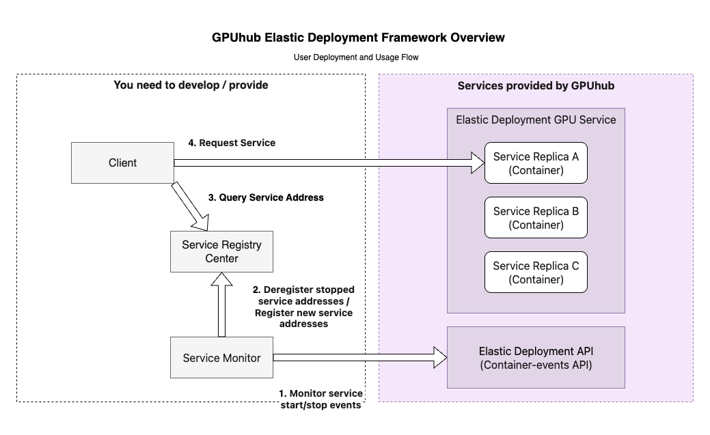

## Choose a Deployment Type

- For one-time tasks, use **Container/Job** deployments.
- For services, use **ReplicaSet** deployments. ReplicaSet manages container replicas and starts a replacement if a container exits unexpectedly. For reliable service delivery, combine ReplicaSet with service discovery and load balancing.

## Configure Images and Storage

When a container starts, the system pulls its image. Put static environments and files that rarely change in the image. Avoid frequent image updates because each update requires the image to be cached on hosts again and can increase startup time.

Store frequently updated files, such as application code and model files, in File Storage. File Storage is shared by containers in the same region and can simplify management across deployments. Its performance is lower than local disks, especially for workloads that read or write many small files. Large-file read and write bandwidth is approximately 100 MB/s. Contact customer support if you need higher performance.

<Warning>
The data disk for each Elastic Deployment container is fixed at 50 GB and cannot be resized.
</Warning>

## Configure Startup Commands

The container runs its configured startup command when it starts. When that command exits, the container stops and is released. The command's lifecycle is therefore the container's lifecycle.

For example, do not start a service in the background with `python app.py &` as the only startup command. The parent process exits while the application continues in the background, causing the system to stop the container and terminate its processes. If you have a specific reason to run it this way, keep the command active with `python app.py &; sleep infinity`.

- For multiple or complex startup steps, put the commands in a shell script stored in the image or File Storage, then use the startup command to run that script.
- Use an explicit working directory for relative paths. For example, if `app.py` is in `/root`, run `cd /root/ && python app.py`.
- For a Conda environment, `conda activate my-env && python xxx.py` may fail because the startup shell cannot switch environments. Call the environment's interpreter directly, for example `/root/miniconda3/envs/my-env/bin/python xxx.py`.

## Improve Service Availability

### Service Discovery and Load Balancing

In a ReplicaSet Elastic Deployment, each container provides an independent HTTPS service address. A container may stop unexpectedly, after which ReplicaSet starts a replacement. To keep the service available, dynamically remove stopped containers' addresses from the registry and add addresses for newly running containers.

Service discovery is commonly implemented on the client or server side. The client-side approach below is straightforward and suits GPU workloads with high compute demand, limited GPU VRAM, and long request times. It combines service discovery with load balancing:

Build a service that polls container status through GPUhub's **Query Container Events** interface. Remove stopped containers from the service registry and register newly running containers. Before making a request, the client retrieves the available service addresses from the registry and selects one according to its load balancing strategy.

**Why doesn't GPUhub provide load balancing?**

Built-in load balancing could simplify client integrations, but common Nginx strategies offer limited control and cannot accurately account for business-specific GPU utilization. Application-managed routing can make decisions based on workload needs to improve utilization and control costs.

### Stop a Specific Container

For a ReplicaSet deployment, you can control the number of running containers by changing the replica count. To stop a specific container, call the **Stop Container** interface with `decrease_one_replica_num`. This stops the container and decreases the deployment's replica count by one, so ReplicaSet will not start a replacement for it. This parameter applies only to ReplicaSet deployments.

### Block a Faulty Host

If containers on a particular host repeatedly experience abnormal behavior, use the **Set Scheduling Blacklist** API to prevent deployments from being scheduled on that host.

## Reuse Stopped Containers

Image pulls are often the main source of Elastic Deployment startup time. Larger images and more containers starting at once can increase that time. Container reuse can reduce startup time by restarting eligible stopped containers instead of pulling the image and creating new containers.

### How Reuse Works

1. After a container is stopped, the system may retain it in a reusable container pool according to system policy, for up to seven days.
2. When a new container is needed, the system looks for a stopped container matching the deployment conditions, including its image and other parameters. If one is available, it is started for the new deployment; otherwise, the normal image-pull and container-creation process is used.

### Behavior to Know

- **Interfaces:** Set `reuse_container` when creating the deployment. Other interfaces work the same way, so enabling reuse does not require changes to the rest of your API integration.
- **Container data:** Reuse does not restore the container to the image's initial state. Files from the previous run may remain. Remove any residual data that could affect the next run, or use reuse to avoid copying the same files repeatedly.
- **Container UUID:** The GPUhub `ContainerUUID` environment variable contains the current container UUID, including when a stopped container is reused.

Set `reuse_container` to `true` when creating a deployment to enable reuse. The setting applies to that deployment only.

## Debug Startup Failures

If a container starts and then exits unexpectedly, temporarily change its startup command to `sleep infinity`. Once the container is running, connect through SSH and run the original command manually, such as `python app.py`, to inspect errors interactively. After debugging, update the deployment with the correct startup command.

## Deploy Large Models with Custom Images and File Storage

For inference workloads that repeatedly create and release instances, keep the runtime environment separate from model weights. Save the configured runtime as a custom image and store model weights in GPUhub File Storage. This avoids rebuilding the environment and downloading large model files for each deployment.

### Workflow

1. Create an instance with a pre-installed image.
2. Configure and test the inference environment for your model.
3. Save the instance as a custom image and obtain its Image UUID.
4. Store the model weights in File Storage.
5. Create an Elastic Deployment using the custom image.
6. Load the model weights from File Storage and start inference.

### Prepare the Runtime Environment

Create a regular GPUhub instance using a suitable [pre-installed image](/environment/overview). Install the frameworks, Python packages, inference engines, system dependencies, and other components your application needs on the system disk. When the environment is ready and tested, [save the instance as a custom image](/environment/image#save-image) for use in future Elastic Deployments.

### Get the Custom Image ID

After the custom image is created, find its Image UUID under **My Images**. Select this image when creating future Elastic Deployments.

### Store Model Weights in File Storage

Model weights generally should not be included in the custom image. Store them in GPUhub [File Storage](/file-storage), which is shared across instances in the same region and mounted at `/root/autodl-fs`. New Elastic Deployment containers can then access the same files without downloading them again from an external source.

### Create the Elastic Deployment

Select **My Images** and choose the custom image prepared above. The container will start with the inference environment already installed, while the model weights remain accessible in File Storage. Configure the startup command to launch the inference service and load the model from its File Storage path.

This approach is useful for large-model inference services that need to scale or restart repeatedly. The custom image provides a consistent runtime environment, while File Storage keeps model files persistent and accessible across instances.
